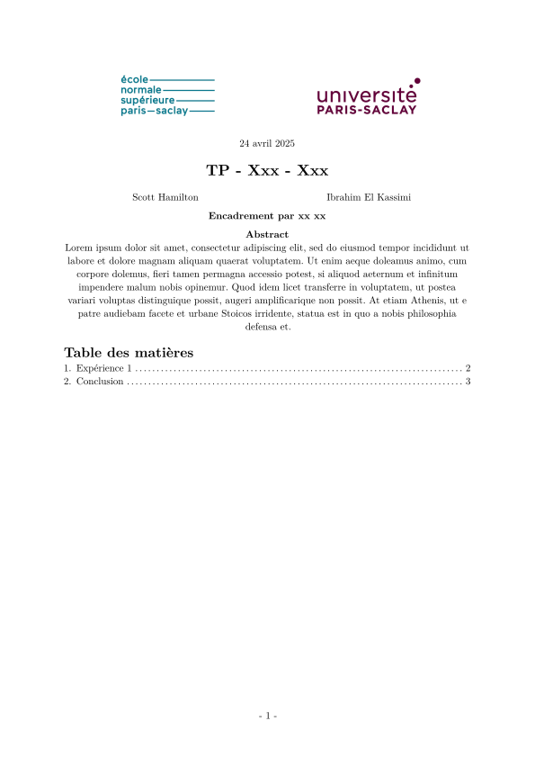
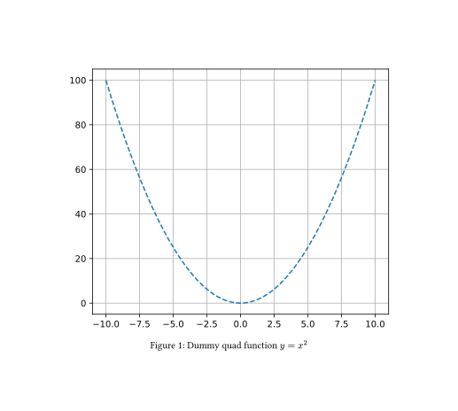

# template-typst-tp-ensps
Un setup pour pouvoir collaborer sur un même compte rendu de TP.

<p align="center">
    
</p>

## Pour commencer
Ce setup est basé sur Nix, si vous ne l'avez pas, c'est [par ici](https://nix.dev/install-nix#install-nix).
Puis sur l'ordinateur hôte, lancer
```shell_command
$ nix run .#typst-serve-watch
```
Remarquer les URL affichées.
Maintenant sur l'hôte et les invités, lancer vscode (en réalité vscodium) avec
```shell_command
$ nix run .#vscodium
```
(vous pouvez aussi lancer votre propre vscode si vous voulez et ouvrir le dossier du template, ce qui signifie que les invités n'ont pas besoin d'installer Nix qui n'est nécessaire que pour `typst-serve-watch`)
Dans vscode, installer l'extension [Open Collab](https://open-vsx.org/extension/typefox/open-collaboration-tools) ou alternativement Live Share(qui n'est pas disponible sur vscodium).
Créer une session sur l'hôte et laisser les inviter rejoindre la session.

Mainenant, les invités peuvent éditer les fichiers. Pour les laisser lire le fichier pdf du compte rendu `main.pdf`, chaque PC invité doit ouvrir une des URL (la première devrait marcher, sinon essayer les autres). Cette url doit afficher le pdf du compte rendu, sinon au moins une erreur de compilation Typst. Le pdf affiché est mis-à-jour à chaque modification du fichier du compte rendu `main.typ`.

Pour la coloration syntaxique Typst sur vscode, je conseille [tinymist](https://github.com/Myriad-Dreamin/tinymist). Attention cependant, tinymist ne pourra pas compiler le fichier `main.typ` sur les PC invités.

**Attention**: pour que **typst-serve-watch** puisse communiquer avec les invités, il faut que le port utilisé par `typst-serve-watch` (27717 par défaut) soit ouvert en TCP (et probablement en UDP aussi). Pour changer le port d'écoute à 8080 par exemple, utiliser `nix run .#typst-serve-watch -- --port 8080`.  Il faut évidemment aussi que hôte et les invités soient connectés au même réseau. (Si l'hôte est connecté à plusieurs réseaux, il faudra que les invités utilisent l'URL correspondante à l'adresse IP de l'hôte sur leur réseau).

## Fonctionnement de **typst-serve-watch**
Les invités ne peuvent que lire et écrire les fichiers `plain-text` (non binaires) car les extensions de collaboration (Open Collab ou Live Share) ne supportent pas le partage de fichiers binaires. C'est l'hôte qui compile `main.typ` et qui sert le pdf résultant `main.pdf` aux invités, au travers de l'outil **typst-serve-watch**.

**typst-serve-watch** est un serveur python ([aiohttp](https://docs.aiohttp.org/en/stable/index.html)). Il execute en sous-main `typst watch main.typ` (en réalité il utilise [typix](https://github.com/loqusion/typix) avec `nix run .#watch`). Si la compilation est un succès, alors le fichier pdf résultant `main.pdf` est servi aux invités (aux clients connectés au serveur par websocket), sinon, le message d'erreur de typst est envoyé.

Au démarrage, une list d'URLs est affichée sur le terminale ainsi qu'un QRcode. Le serveur écoute sur toutes ces URLs pour une demande de connexion. Le QRcode est destiné aux terminaux mobiles et correspond à la première URL de la liste.

 > server.py a été développé en grande partie avec l'aide de deepseek.

## Intégration jupyter-typst
Avec l'aide de [callisto](https://typst.app/universe/package/callisto), on peut désormais laisser Typst chercher les figures d'une cellule jupyter.

Par example, avec cette cellule jupyter dans `code.ipynb`
```python
#| label: fig-quad
import numpy as np
from matplotlib import pyplot as plt
from matplotlib_inline import backend_inline
backend_inline.set_matplotlib_formats("svg") # Pour obtenir une image vectorielle

x = np.linspace(-10, 10, 1000)
plt.figure()
plt.plot(x, x**2, "--")
plt.grid()
plt.show()
```
et ce code typst
```typst
#import "@preview/callisto:0.1.0"

#figure(
  callisto.display("fig-quad", nb: json("code.ipynb")),
  caption: [Dummy quad function $y=x^2$]
) <fig-quad>
```
on obtient la figure suivante 

## Aide

N'hesitez pas à fork le projet et à contribuer.

## License
Cette repo est proposée telle quelle sous license MIT.

**References utiles**
 - [aiohttp doc] : <https://docs.aiohttp.org/en/stable/index.html>

[//]: # (These are reference links used in the body of this note and get stripped out when the markdown processor does its job. There is no need to format nicely because it shouldn't be seen. Thanks SO - http://stackoverflow.com/questions/4823468/store-comments-in-markdown-syntax)

   [aiohttp doc]: <https://docs.aiohttp.org/en/stable/index.html>
